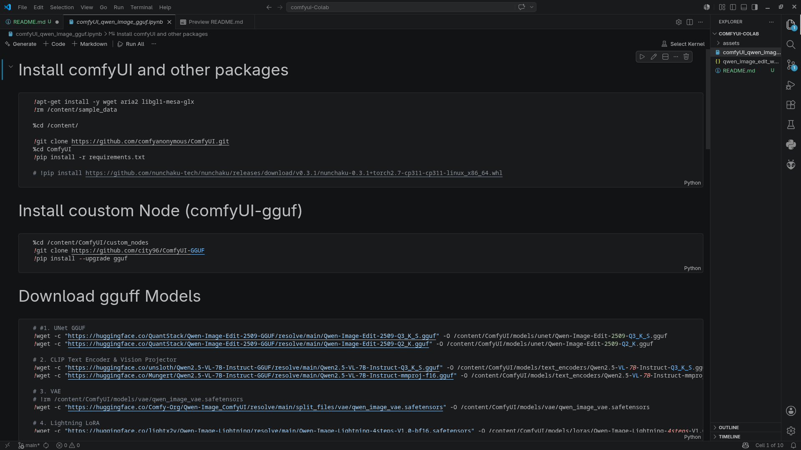
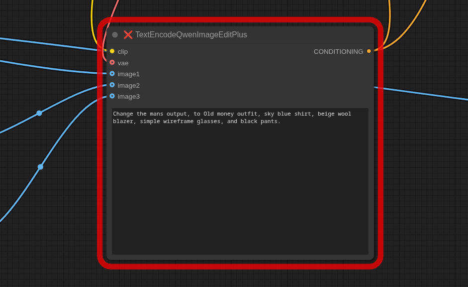

# Google Colab+ComfyUI Qwen-Image-Edit:   

A python interactive notebook to easily deploy and run ComfyUI on Google Colab, with all settings configured to run the Qwen-Image-Edit model with a custom node to easily manipulate images.

This repository alleviates the pain of manual environment setups, model downloads, and dependency conflicts, providing a one click cell execution environment to get you up and running in minutes.

# Install ComfyUI on Colab

Open Colab & upload the `comfyUI_qwen_image_gguf.ipynb` and connect to a runtime with gpu.

After that the note book will walk you through. 

# run workflow :

Open `qwen_image_edit_workflow.json` on Comfyui and it will probably ready to run

Just upload and image discribe in the prompt and just run

    

        <h2>Source</h2>
        
    

    

        <h2>Output (Qwen-Image)</h2>
        
    

    

        <h2>Output (Gemini-Image)</h2>
        
    

